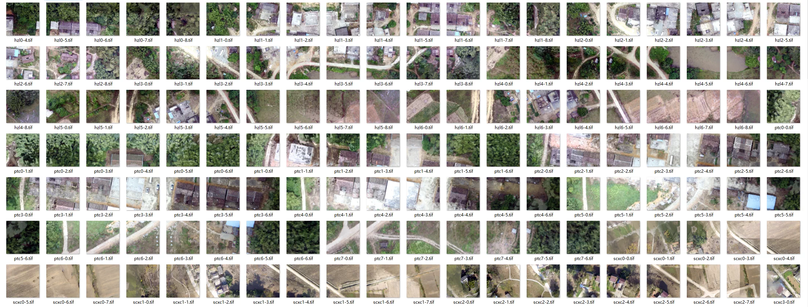
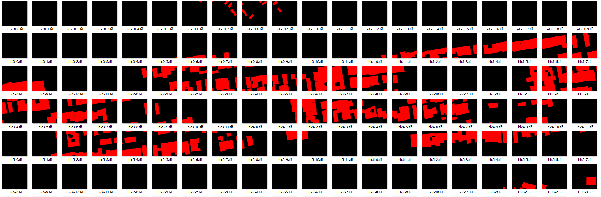
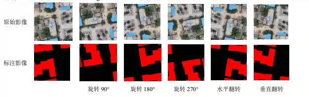
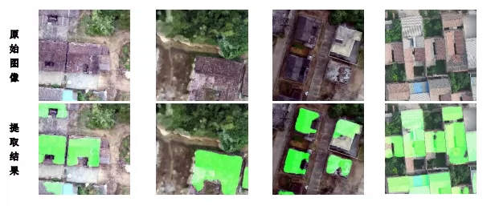
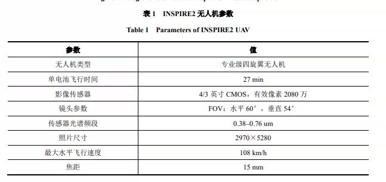
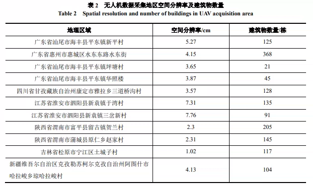

## Body

"China Rural Drone Buildings and Labels Segmentation Dataset"

Collection medium: DJI Inspire2 professional four-rotor drone, field photography collection from 2017 to 2020;
Coverage area: Covering 11 typical villages across 7 provinces / autonomous regions, including South China, Southwest China, East China, Northwest China, Northeast China: Guangdong, Sichuan, Jiangsu, Shaanxi, Jilin, Xinjiang;

The dataset is divided into two main modules, all in tif format RGB orthophotos + binary labeling images (paired with input original image / target labeled image):

Origin raw cropping set: input original image: 1010; target manual labeled image: 1010

Augmented data enrichment expansion set: Rotating the original image by 90°/180°/270°, horizontal flip, vertical flip, five transformations, generating 6 samples for each original image: input enhanced image: 6060; target corresponding labeled image: 6060

Labeling images are binary maps, only two types of land use: Buildings: Red pixels; Non-buildings (open space, vegetation, road, farmland, etc.): Black pixels

Contains the source article by the author

## Images

item_1064486546087

Here is a pay link on Stripe ( https://buy.stripe.com/3cs8yP7sY87d0vu9AB ). Please contact me lonlonago@foxmail.com after funding $89, and I will send you a complete data files , thank you!

